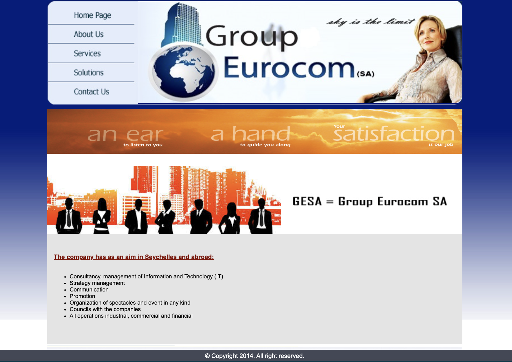
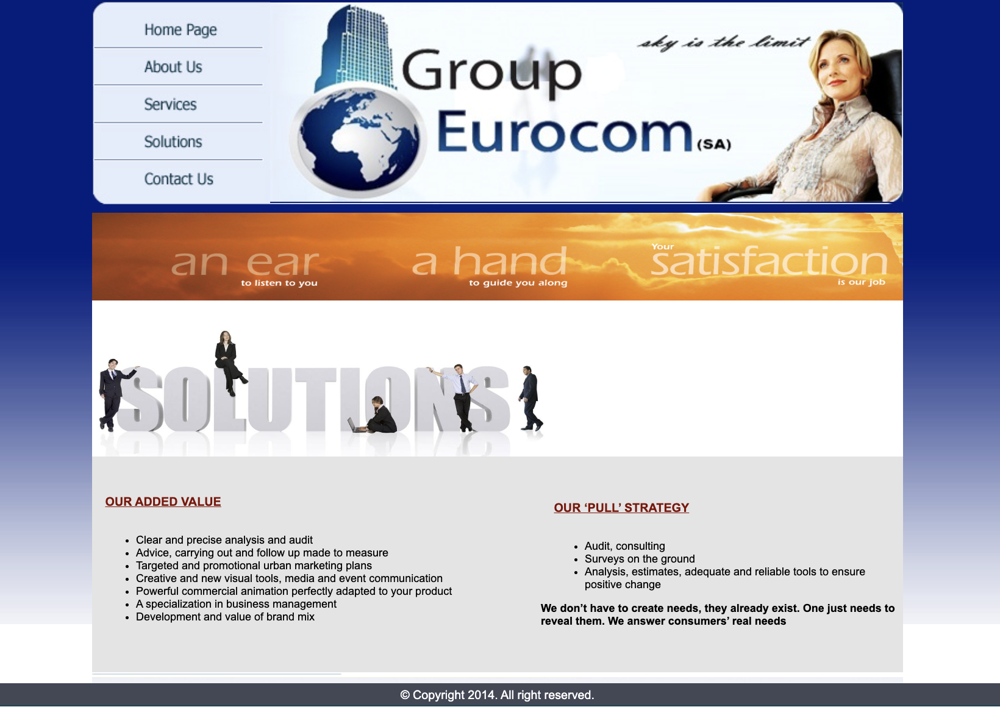

# Groupe Eurocom – Website Redesign

## Overview

This project is a **modern redesign of the Groupe Eurocom SA website**.

The original website, created around **2014**, can be accessed here:
http://www.groupeurocomsa.com/index.html

The goal of this project was to **modernize the design, improve usability, and make the website fully responsive** across desktop, tablet, and mobile devices.

The redesigned version is available here:
https://groupeurocomsa.vercel.app/

---

## Why this redesign

The previous version of the website had several limitations:

* The design was **outdated (created around 2014)**
* The website was **not responsive**
* The layout did not adapt to mobile or tablet screens
* The visual structure and navigation could be improved

This redesign focuses on providing a **clean, modern, and responsive interface** while preserving the original content and company identity.

---

## Improvements

The new version introduces several improvements:

* Modern and cleaner UI
* Fully **responsive design**
* Improved layout and navigation
* Better visual hierarchy
* Enhanced user experience

---

## Technologies Used

* Next.js
* React
* Tailwind CSS
* TypeScript

---

## Live Website

You can view the redesigned website here:

https://groupeurocomsa.vercel.app/

---

## Running the Project Locally

### 1. Clone the repository

```bash
git clone https://github.com/ItsAlette/refonte-groupeurocomsa.git
```

### 2. Navigate to the project folder

```bash
cd refonte-groupeurocomsa
```

### 3. Install dependencies

```bash
npm install
```

### 4. Run the development server

```bash
npm run dev
```

Then open your browser and go to:

```
http://localhost:3000
```

---


## Previous Website Screenshots

Below are screenshots of the **original version of the website**.

*(Add the screenshots here)*

Example:







---

## Author

Website redesign and development by **Alette Dieme**
